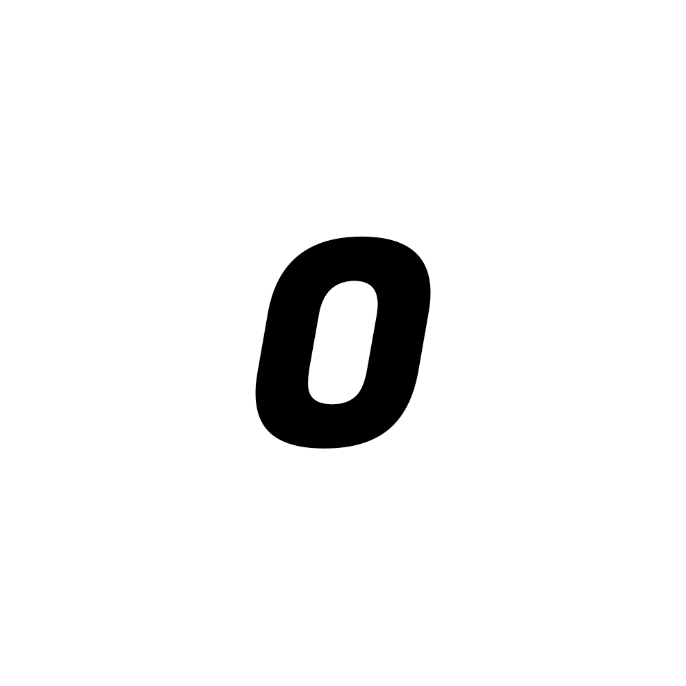

# branding

At OskarsMC, we're keen on keeping things to a high standard. If you are going to use our assets for something please keep it taseful. If you are unsure whever you are following the branding guidelines please [contact us](https://contact.oskarsmc.com/).

## The logo

Please do not edit, change, distort, or reconfigure the OskarsMC Logo

<table>
  <thead>
    <tr>
      <th>Logo</th>
      <th>Variant</th>
      <th>Image</th>
    </tr>
   </thead>
   <tbody>
     <tr>
       <td>OskarsMC</td>
       <td>gradient-pink</td>
       <td></td>
     </tr>
    <tr>
       <td>OskarsMC</td>
       <td>gradient-pink-transparent</td>
       <td></td>
     </tr>
     <tr>
       <td>OskarsMC</td>
       <td>black</td>
       <td></td>
     </tr>
     <tr>
     </tr>
  </tbody>
</table>

## Colours

<table>
  <thead>
    <tr>
      <th>Colour</th>
      <th>RGB</th>
      <th>HEX</th>
    </tr>
   </thead>
   <tbody>
     <tr>
       <td></td>
       <td>255,81,81</td>
       <td>#ff5151</td>
     </tr>
     <tr>
       <td></td>
       <td>255, 149, 149</td>
       <td>#ff9595</td>
     </tr>
    <tr>
        <td></td>
       <td>255, 255, 255</td>
       <td>#FFFFFF</td>
     </tr>
     <tr>
        <td></td>
       <td>0, 0, 0</td>
       <td>#000000</td>
     </tr>
  </tbody>
</table>
